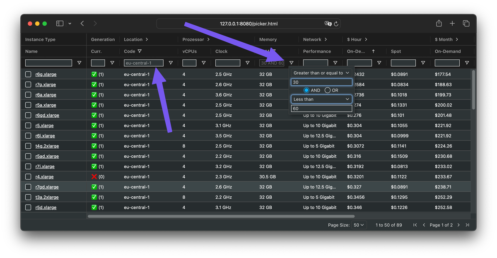

# AWS Pricing

This [webapp](https://aws-pricing.com/) helps you compare all Amazon Elastic Compute Cloud (EC2) instance types across all AWS locations with ease.
No more hopping between AWS docs – filter, sort, and choose the optimal Amazon EC2 instance type for your needs.

## 🖊️ Add, edit or change instance type information

This project values transparency and collaboration.
For EC2 instance type information, we rely on the official Amazon EC2 API (`describe-instance-types`), ensuring data accuracy and updates.
Additional data resides in well-defined SQL files, making it easily understandable and modifiable.

Dive into the [build](./build/) folder to see how the data is retrieved, processed, and integrated.
Feel free to explore and contribute!

## ❤️ Contributing

Got a patch that boosts this project?
Get involved by contributing bug fixes and features through pull requests.
Here's your roadmap to contribution awesomeness:

* Prep: Please read [how to contribute](./CONTRIBUTING.md).
* Fork it: Make your own copy of the repo on GitHub.
* Patch it: Work your magic and commit your changes.
* Pull it: Share your work with a Pull Request (PR).
* Iterate it: Respond to any feedback in the PR comments.
* Merge it: Voila! Your contribution shines in the project! ✨

## 📜 License

All files in this repository are under the [Apache License, Version 2.0](./LICENSE) unless noted otherwise.

Portions of this webapp are modifications based on work created and shared by [Amazon Web Services](https://aws.amazon.com/terms/) and used according to terms described in the [Creative Commons 4.0 Attribution-ShareAlike License](https://creativecommons.org/licenses/by-sa/4.0/).

Please note:

* No warranty
* No official Amazon Web Services product
