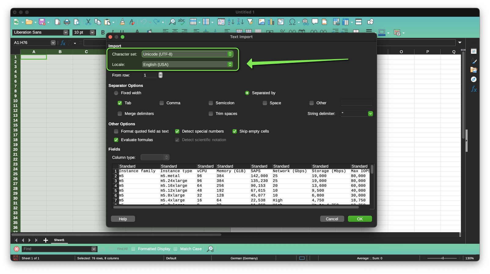
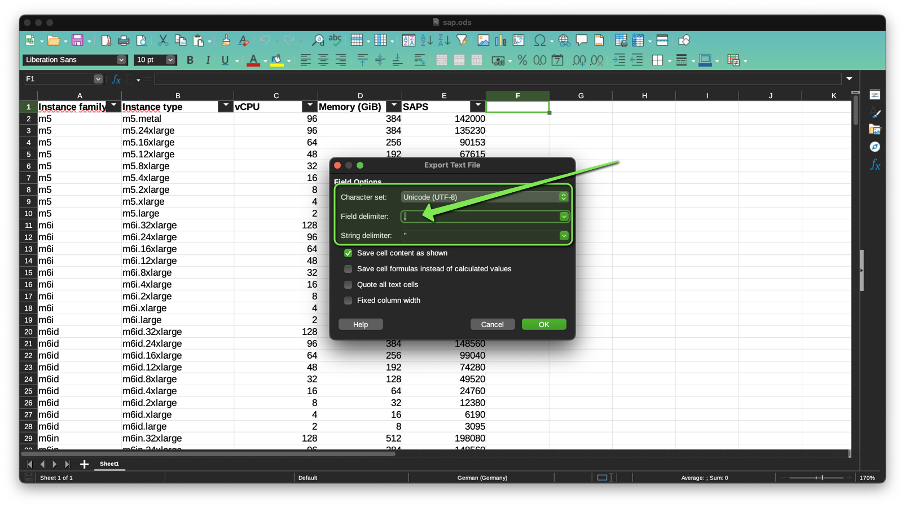

# Build

This project uses GitHub Actions for automated builds and deployments.
Ready to tweak and test this webapp locally?
Follow these instructions:

## Requirements

Ready to tinker? For development, you'll need:

* AWS CLI (`aws`)
* curl (`curl`)
* jq (`jq`)
* SQLite3 (`sqlite3`)
* Perl 5 (`perl`)
* Perl modules:
	* [DBD::SQLite](https://metacpan.org/pod/DBD::SQLite)
	* [JSON::XS](https://metacpan.org/pod/JSON::XS)
	* [plackup](https://metacpan.org/dist/Plack/view/script/plackup)
	* [Template::Toolkit](https://metacpan.org/pod/Template::Toolkit)
	* [Text::CSV](https://metacpan.org/pod/Text::CSV)

<details>
<summary><b>Debian/Ubuntu</b></summary>

Packages:

```bash
sudo apt update
sudo apt install \
	awscli \
	curl \
	jq \
	libdbd-sqlite3-perl \
	libjson-xs-perl \
	libplack-perl \
	libtemplate-perl \
	libtext-csv-perl \
	sqlite3
```
</details>

<details>
<summary><b>macOS</b></summary>

Homebrew packages:

```bash
brew install \
	awscli \
	cpanminus \
	curl \
	jq \
	perl \
	pkg-config \
	sqlite3
```

Perl modules:

```bash
cpanm --installdeps .
```
</details>

## Create Database

```bash
sqlite3 ec2.db < create.sql
```

## Locations

```bash
curl -O "https://b0.p.awsstatic.com/locations/1.0/aws/current/locations.json"
perl locations.pl < locations.json
```

## IP Ranges

```bash
curl -O "https://ip-ranges.amazonaws.com/ip-ranges.json"
perl ip-ranges.pl < ip-ranges.json
```

## Prices

```bash
# On-demand and reserved price
bash price-lists.sh
# Spot price
curl -O "https://website.spot.ec2.aws.a2z.com/spot.json"
perl spot.pl < spot.json
```

## Instace Types (EC2)

We're gonna assume `us-east-1` (N. Virginia) has all the available instance types.

```bash
aws ec2 describe-instance-types --region us-east-1 --output json > instance-types.json
perl instance-types.pl < instance-types.json
```

## Storage Types (EBS)

We're gonna assume `us-east-1` (N. Virginia) has all the available storage types.

```bash
sqlite3 ec2.db < storage-types.sql
```

## SAP

Copy tables from [AWS General SAP Guide](https://docs.aws.amazon.com/sap/latest/general/sap-netweaver-aws-ec2.html) and paste as unformatted text (<kbd>Crtl</kbd>+<kbd>Shift</kbd>+<kbd>V</kbd>)to LibreOffice Calc Spreadsheet:



Export as CSV (`sap.csv`, `sap-hana.csv`):



Update database:

```bash
perl sap.pl
perl sap-hana.pl
```

## Export

```bash
bash export.sh
```

## Websites

```bash
perl web.pl
```

Run:

```bash
plackup --host "127.0.0.1" --port "8080"
```

## Help

* Reserved Instances: <https://aws.amazon.com/ec2/pricing/reserved-instances/>
* Spot Instances: <https://aws.amazon.com/ec2/spot/>
* Compute Savings Plans: <https://docs.aws.amazon.com/savingsplans/latest/userguide/what-is-savings-plans.html>
* EBS Volume types: <https://docs.aws.amazon.com/AWSEC2/latest/UserGuide/ebs-volume-types.html#vol-type-ssd>
* EBS performance: <https://docs.aws.amazon.com/AWSEC2/latest/UserGuide/general-purpose.html#gp2-performance>
* Connect GitHub Actions: <https://aws.amazon.com/blogs/security/use-iam-roles-to-connect-github-actions-to-actions-in-aws/>